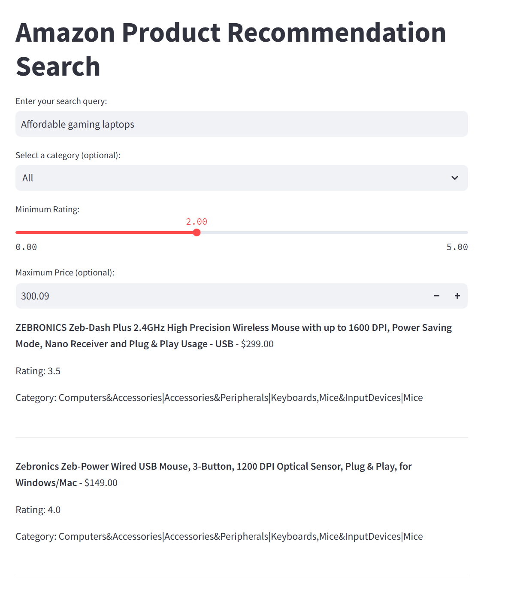

# Amazon Product Recommendation Semantic Search Tool

Semantic search is a data searching technique that focuses on understanding the contextual meaning and intent behind a user’s search query, rather than only matching keywords. Instead of merely looking for literal matches between search queries and indexed content, it aims to deliver more relevant search results by considering various factors, including the relationships between words, the searcher’s location, any previous searches, and the context of the search. Traditional search engines typically focus on matching keywords within a search query to corresponding keywords in indexed web pages. In contrast, semantic search aims to comprehend the deeper meaning and intent behind a user's search, much like a human would. By understanding the meaning and context of words, phrases, and entities within a search query, semantic search strives to deliver highly relevant search results that satisfy the user's information needs.

## Features

**Semantic Search**: Search and rank products based on meaning, not just keywords.

**Query Expansion**: Automatically expand user queries with synonyms and related terms for improved search accuracy.

**Filters**: Refine search results by category, minimum rating, and maximum price.

**Optimized for Speed**: Caches embeddings and models to minimize computation time.

**Interactive UI**: Built using Streamlit for an easy-to-use interface.

## Dataset

The dataset used for this project includes information about Amazon products, including attributes like:

product_name: Name of the product.

category: Product category.

discounted_price: Discounted price of the product.

rating: Product rating.

about_product: Product description.

review_title and review_content: User reviews.

The dataset file (amazon.csv) and precomputed embeddings (amazon_products_with_embeddings.pkl) are included in this repository.

## Setup Instructions

Prerequisites

Python 3.8+

**Install dependencies**

pip install pandas streamlit sentence-transformers scikit-learn numpy nltk

**Run the App**

Clone the repository:

git clone <repo-url>
cd <repo-directory>

Run the Streamlit app:

streamlit run stream.py

Open the app in your browser (usually at http://localhost:8501).

## How It Works

Preprocessing: Text fields like product_name, about_product, and reviews are cleaned and combined.

Embedding Generation: Sentences are converted into numerical embeddings using a pre-trained SentenceTransformer model.

Query Expansion: User queries are expanded with synonyms using WordNet.

Semantic Search: Computes cosine similarity between the query and product embeddings to rank results.

Filtering: Filters like category, rating, and price refine the search results.

sample query and output

### Dependencies

pandas: Data manipulation and analysis

streamlit: Building the interactive UI

sentence-transformers: Generating embeddings for semantic search

scikit-learn: Calculating cosine similarity

numpy: Numerical operations

nltk: Query expansion using WordNet
